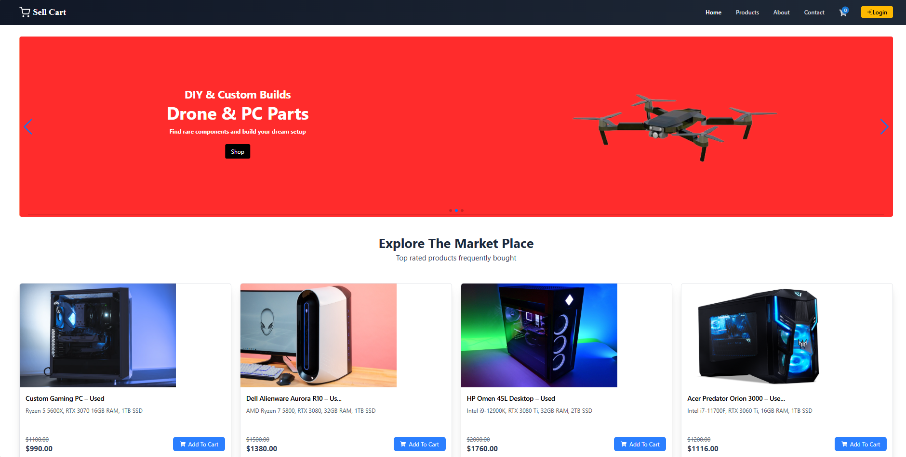
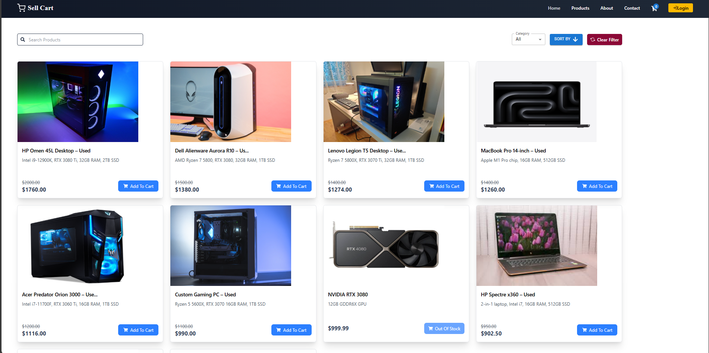

# 🛒 Application Name: Sell Cart

Sell Cart is a full-stack e-commerce web application currently under development.  
It is designed for **individual buyers and sellers** to list, browse, and purchase products — whether new or used.  
Unlike large corporate marketplaces, Sell Cart focuses on **peer-to-peer commerce**, making it simple for anyone to buy or sell with ease.

---
📸 App Preview

---
## ✨ Sell Cart Features

- 🔑 **User Accounts** – Register, log in, and manage personal profiles.  
- 🔎 **Search & Browse** – Discover products by keyword or category.  
- 🛒 **Shopping Cart** – Add items to cart and manage before checkout.  
- 💳 **Checkout & Payments** – Secure transaction flow with stripe.  

---

## 🏗️ Tech Stack

- **Frontend**: React (JavaScript)  
- **Backend**: Spring Boot (Java)  
- **Database**: PostgreSQL 
- **Authentication**: JWT-based auth 
- **Deployment**:  Docker, AWS 

---
## 🐳 Installation via Docker
- `git clone git@github.com:SahisN/E-Commerce-Project.git`
- `cd E-Commerce-Project`
- `docker compose --env-file .env up --build -d`
- go to: `http://localhost:3000/` in any browser
